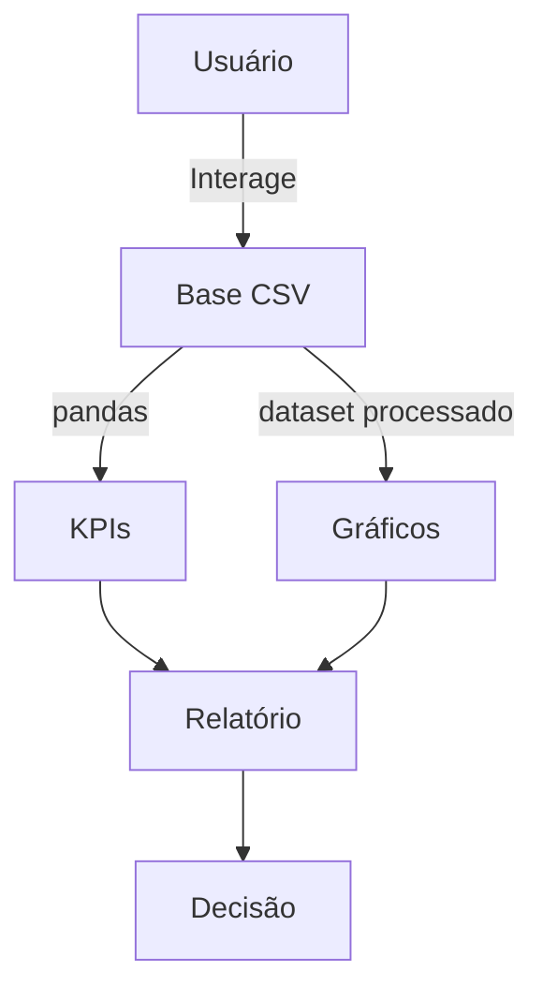

# 📊 Análise de Dados de Redes Sociais

**Disciplina:** Programação para Ciência de Dados  
**Curso:** MBA Ciência de Dados – UNIFOR  
**Instrutor:** Cássio Pinheiro  
**Integrantes:**  
- Pedro Lucas Freitas Campos (Matrícula: 2528499)

**Repositório GitHub:** https://github.com/Pedrolucasfcampos/Analise-de-Dados-de-Redes-Sociais

**Data de Entrega:** 14/11/2025

---

## 🎯 Objetivo
Mapear engajamento em rede social simulada (curtidas, comentários, compartilhamentos) para identificar autores influentes, conteúdos de destaque e comportamento temporal.

**Problema resolvido:** métricas quantitativas para embasar decisões de impulsionamento.  
**Público-alvo:** estudantes/profissionais praticando ETL, análise descritiva e relatórios automatizados.

---

## 🧩 Diagrama de Contexto


---

## ✅ Funcionalidades
- Ingestão validada dos CSVs (`src/data/ingestion.py`).
- Limpeza, normalização e enriquecimento (`src/data/preprocessing.py`).
- KPIs, ranking, distribuições e timeline (`src/analysis/engajamento.py`).
- Relatório Markdown automatizado (`src/reporting/summary.py`).
- Gráficos Matplotlib simples (`src/visualization/matplotlib_charts.py`).
- Testes de métricas principais (`tests/test_analysis.py`).

---

## 🗂️ Estrutura de Dados
- `dados/raw/usuarios.csv`: usuário, segmento.  
- `dados/raw/conteudos.csv`: autor, categoria, data.  
- `dados/raw/interacoes.csv`: histórico de interações (timestamp ISO).  
- `dados/processed/engajamento.csv`: dataset consolidado com pesos e campos auxiliares.  
> Os arquivos `raw/` são sintéticos e podem ser substituídos por dados reais.

---

## 🔧 Requisitos
- Python 3.11+ (testado em 3.13).  
- Dependências: pandas 2.2.3, numpy 2.1.3, matplotlib 3.9.2, pytest 8.3.3.  
- Ambiente virtual recomendado (`python -m venv .venv`).  
- UTF-8 forçado no Windows para evitar problemas de acentuação.

---

## ▶️ Execução Rápida
```bash
# 1. Ambiente
python -m venv .venv
.\\.venv\\Scripts\\activate   # Windows
source .venv/bin/activate     # Linux/Mac
pip install -r requirements.txt

# 2. Pipeline completo (gera CSV + relatório + gráficos)
python main.py

# 3. Sem gráficos (mais rápido)
python main.py --skip-plots

# 4. Testes
pytest -v
```
> Certifique-se de manter `usuarios.csv`, `conteudos.csv`, `interacoes.csv` em `dados/raw/`.

---

## 📈 Análises Geradas
- KPIs: total de interações, conteúdos analisados, usuários participantes, engajamento médio por conteúdo.
- Ranking dos autores com maior score ponderado.
- Distribuições por categoria e tipo de interação.
- Timeline diária (score e volume) para detectar picos.
- Relatório Markdown com tabelas e insights principais.

---

## 🗃️ Estrutura
```text
Analise-de-Dados-de-Redes-Sociais/
├── dados/
│   └── raw/                 # Fontes CSV fornecidas
├── src/
│   ├── analysis/            # Métricas e KPIs
│   ├── data/                # Ingestão e preparação
│   ├── reporting/           # Geração do relatório Markdown
│   ├── utils/               # Utilidades compartilhadas
│   └── visualization/       # Funções Matplotlib
├── tests/                   # Testes de unidade
├── main.py                  # Ponto de entrada do pipeline
├── requirements.txt         # Dependências
├── README.md                # Documentação principal
└── ESPECIFICACOES_PROJETO_FINA.pdf
```
> Artefatos gerados como `dados/processed/`, `relatorios/` e `visualizacoes/` são criados em tempo de execução e não ficam versionados.

---

## 🖼️ Exemplos
- `visualizacoes/score_por_categoria.png`  
- `visualizacoes/timeline_engajamento.png`  
- Saída típica:
```
dataset_processado: dados/processed/engajamento.csv
relatorio_markdown: relatorios/relatorio_engajamento.md
graficos: visualizacoes/score_por_categoria.png, visualizacoes/timeline_engajamento.png
```

---

## ✅ Testes
- Imagens de resultados: https://drive.google.com/drive/folders/1JlA-eBcDCPGORorDQpdhoehJ7FjqyHEX?usp=sharing


---

## 📚 Referências
- `ESPECIFICACOES_PROJETO_FINAL.pdf` (documento oficial da disciplina).  
- Documentação Pandas: https://pandas.pydata.org/  
- Documentação Matplotlib: https://matplotlib.org/
- Grok para code review, geração de datasets, ajuda nos comentários e documentação
- Documento de estudo da disciplina: Programacao_Intensiva_Ciencia_de_Dados

---

## 👥 Contribuição
| Integrante | Responsabilidades |
| --- | --- |
| Pedro Lucas Freitas Campos | Planejamento, implementação dos módulos Python, preparação dos dados e documentação |

---

## 📝 Qualidade e Próximos Passos
- Docstrings completas, comentários explicativos e type hints.
- Tratamento de erros na ingestão e estrutura modular por camadas.
- Melhorias sugeridas: dados reais, API/dashboard, mais testes (ingestão/visualização), relatório HTML/PDF, novos formatos (JSON/DB) e cache para execuções repetidas.
